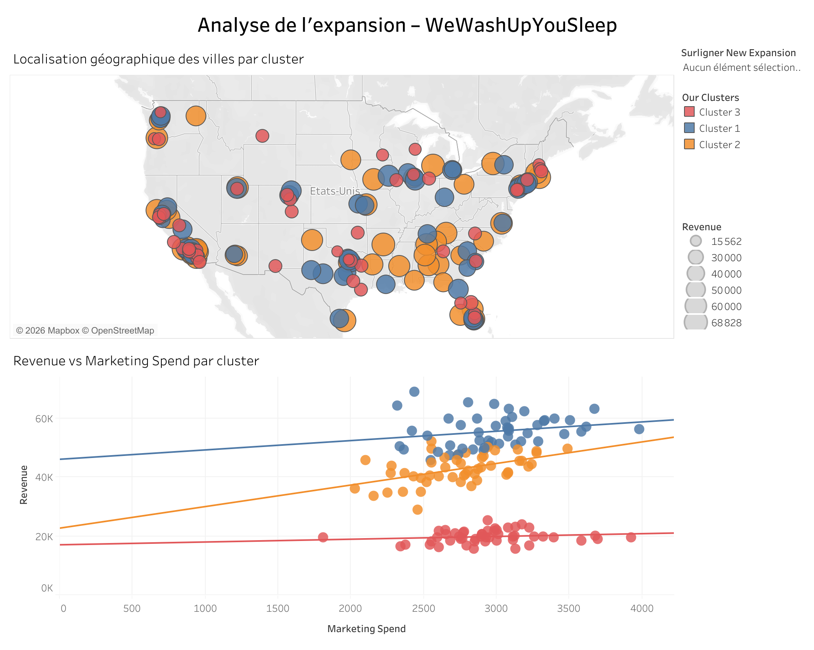

# Segmentation et ciblage géographique – Analyse d'expansion

## Contexte métier
WeWashUpYouSleep est une startup de services de laverie à domicile qui 
mise sur un réseau de petites villes pour se développer. Avec 140 
implantations existantes et 10 nouvelles villes récemment ouvertes, 
l'entreprise cherche à optimiser ses investissements marketing.

## Problématiques
1. Quelle région commerciale performe le mieux sur 3 métriques clés : 
revenu moyen, dépense marketing moyenne et ROMI moyen par ville ?
2. Parmi les 10 nouvelles villes, lesquelles ont le meilleur potentiel 
pour un investissement marketing accru ?

## Démarche
- Clustering des villes selon leur revenue et leur marketing spend
- Visualisation scatter plot Revenue vs Marketing Spend par cluster
- Cartographie géographique des clusters sur les États-Unis
- Highlighter pour isoler les nouvelles implantations

## Compétences mobilisées
- Clustering dans Tableau
- Custom Territories
- Cross-Database Joins
- Cartographie

## Visualisation

🔗 [Voir sur Tableau Public](https://public.tableau.com/views/Segmentationetciblagegographique-Analysedexpansion/AnalysedelexpansionWeWashUpYouSleep)

## Outils
- Tableau Public

## Données
Jeu de données fictif (exercice pédagogique).
